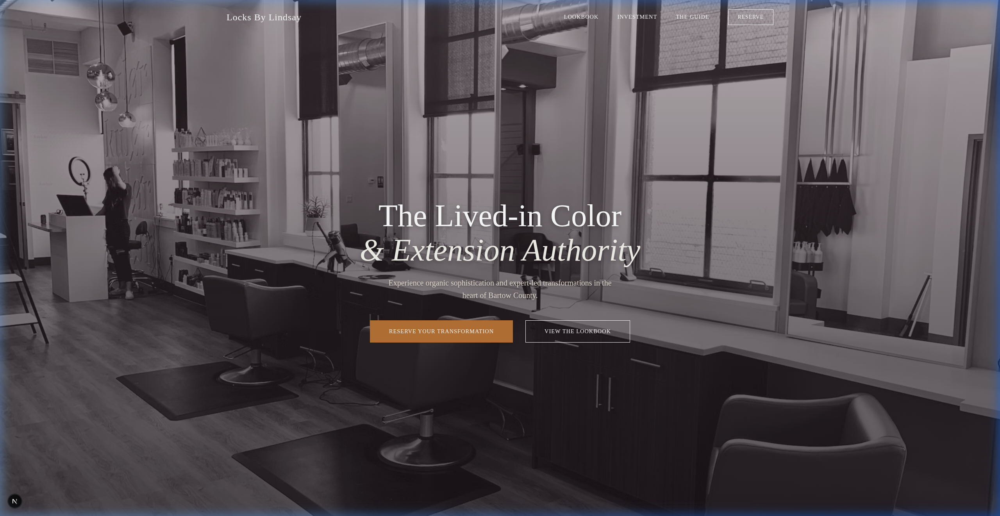

<div align="center">

# Locks By Lindsay

### *The Lived-in Color & Extension Authority for Bartow County*

**[🌍 View Live Site](https://abaxley2.github.io/locks-by-lindsay)**

[](https://nextjs.org/)
[](https://react.dev/)
[](https://www.typescriptlang.org/)
[](https://developer.mozilla.org/en-US/docs/Web/CSS)

A high-conversion, editorial-style web platform for a specialist hair studio in Cartersville, GA —
built with an *Organic Sophistication* aesthetic that prioritizes premium UX, local SEO, and seamless booking.



</div>

---

## Features

| Feature | Description |
|---|---|
| **Investment Menu** | Transparent, beautifully structured pricing for lived-in color & extensions |
| **New Client Portal** | Dedicated onboarding flow with a full digital consultation form |
| **Floating Reserve Button** | Persistent, high-visibility CTA optimized for conversions |
| **Social Proof** | Live Instagram feed integration & dynamic client review slider |
| **Local SEO** | Mobile-first with JSON-LD schema markup for Bartow County dominance |
| **The Guide** | Editorial content hub for client education and trust-building |

---

## Tech Stack

| Layer | Technology |
|---|---|
| **Framework** | [Next.js 16](https://nextjs.org/) — App Router |
| **UI Library** | [React 19](https://react.dev/) |
| **Language** | [TypeScript 5](https://www.typescriptlang.org/) |
| **Styling** | Vanilla CSS — bespoke, no utility frameworks |
| **Typography** | [Playfair Display](https://fonts.google.com/specimen/Playfair+Display) + [Inter](https://fonts.google.com/specimen/Inter) via Google Fonts |
| **SEO** | JSON-LD Structured Data (`HairSalon` schema) |
| **Linting** | ESLint 9 with Next.js config |

---

## Project Architecture

```
src/
├── app/
│   ├── page.tsx              # Homepage — Hero, Trust Bar, Reviews, Instagram
│   ├── layout.tsx            # Root layout, fonts, JSON-LD schema, Floating CTA
│   ├── globals.css           # Design tokens, resets, global styles
│   ├── investment/           # Service & pricing tiers
│   ├── lookbook/             # Portfolio presentation
│   ├── client-portal/        # Guided new-client intake & consultation form
│   ├── guide/                # Editorial content & education hub
│   └── contact/              # Location & direct inquiry
└── components/
    ├── Navigation.tsx         # Responsive top nav
    ├── FloatingReserveButton  # Persistent booking CTA
    ├── TrustBar.tsx           # Social proof bar
    ├── ReviewSlider.tsx       # Animated client review carousel
    └── InstagramFeed.tsx      # Live Instagram feed grid
```

---

## Getting Started

**1. Install dependencies**
```bash
npm install
```

**2. Run the development server**
```bash
npm run dev
```

**3. Open in browser**

Visit [http://localhost:3000](http://localhost:3000) — the app hot-reloads as you make changes.

> Note: If port 3000 is already in use, Next.js will automatically use the next available port (e.g. 3001, 3002). Check the terminal output for the exact URL.

### Other Commands

```bash
npm run build   # Production build
npm run start   # Start production server
npm run lint    # Run ESLint
```

---

## About

**Locks By Lindsay** is a specialist hair studio serving Cartersville, GA and the greater Bartow County area — ZIP codes 30120, 30121, and 30137. This platform was purpose-built to reflect the studio's identity: editorial, elevated, and results-focused.

---

<div align="center">
  <sub>Built with care for Locks By Lindsay · Cartersville, GA</sub>
</div>
